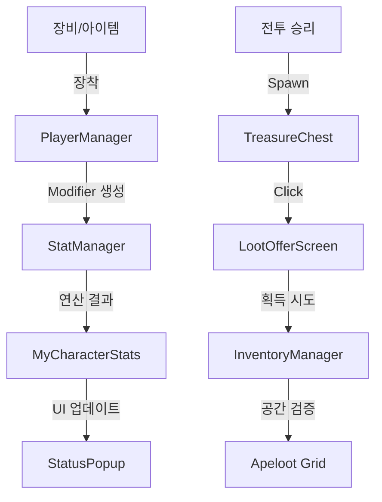

# DDC (Destiny Dungeon Chronicles) Project Master Context
**Last Updated:** 2026-02-14
**Engine:** Godot 4.4.1 (Stable)
**Language:** GDScript
**Platform:** PC (Steam Target)

---

## 1. 프로젝트 정체성 및 핵심 철학
*   **장르:** 로그라이크 RPG (턴제 전투, 트리 구조 던전 탐험).
*   **핵심 재미:** "선택의 무게를 물리적으로 체감하라."
    *   **공간 전략:** 인벤토리 공간이 곧 자원. 골드조차 부피(Grid)를 차지함.
    *   **운명 설계:** 주사위는 단순 RNG가 아닌, 스탯과 보상을 설계하는 도구.
    *   **물리적 상호작용:** 보상은 필드에 생성된 보물상자를 직접 클릭하여 루팅.
    *   **극대화된 긴장감:** 던전 내 저장 불가, 여관(Inn)에서만 저장 가능.

---

## 2. 시스템 아키텍처 (System Architecture)
**구조:** Manager Pattern (Autoloads) + Event-Driven (SignalBus).

### 2.1 Core Managers (Autoloads)
*   **`GameManager`:** 게임 루프, 페이즈 관리, 메인 오케스트레이터.
*   **`SignalBus`:** 모듈 간 결합도를 낮추기 위한 전역 이벤트 중계소.
*   **`PlayerManager`:** 캐릭터 데이터(`CharacterData`) 및 10개 장비 슬롯 관리. 장착 시 `MyStatModifier` 주입.
*   **`StatManager`:** 모든 수치 연산의 중추. 1차 스탯 -> 2차 스탯 파생 및 Modifier 합산.
*   **`DiceManager`:** 주사위 풀 관리 및 굴림 권한 제어. 7프레임 애니메이션 규격 관리.
*   **`InventoryManager`:** `Apeloot` 기반 그리드 인벤토리. 골드 획득 시 공간 검증 수행.
*   **`UIManager`:** `GamePhase` 기반 지능형 화면 전환 및 HUD 복구.

### 2.2 데이터 흐름 (Data Flow)

---

## 3. 상세 기획 명세 (Detailed Mechanics)

### 3.1 전투 시스템 (Combat Mechanics)
*   **행동 게이지 (AP):** 공격 속도 비례 충전. **모션 중(`is_acting`) 충전 정지.**
*   **다중 적 시스템:** 최대 3마리 출현. 자동 타겟 전환 및 데미지 팝업 오프셋 적용.
*   **방어/회피:** '퍼펙트 가드' 성공 시 데미지 90% 감소 및 게이지 50% 보존.

### 3.2 던전 및 탐험 (Exploration)
*   **시작 시퀀스:** 던전 진입 즉시 **운명 설계(스탯 배분)** 강제 수행 후 지도로 진입.
*   **특수 노드:** 함정, 보물상자, 제단, 성소 4종 분기. 이벤트 결과에 따른 루팅 상자 생성.

---

## 4. 개발 내역 히스토리 (Development History)

*   **2026-02-09:**
    *   [Fix] LootOfferScreen 공간 부족 시 아이템 증발 방지.
    *   [Fix] StatManager 장비 해제 시 Modifier 제거 로직 구현.
    *   [New] TDD 도입 및 `test_StatManager.gd` 검증 시작.
*   **2026-02-12:**
    *   [New] 전략적 전리품(Silhouette) 그리드 카드 UI 개편.
    *   [New] 복수 적 전투 및 오토 타겟팅 기초 구현.
*   **2026-02-14 (Today):**
    *   **[Refactor] AP 시스템:** 애니메이션 종료(`finish_action`) 시점에만 게이지 재충전되도록 로직 고도화.
    *   **[New] 루팅 시스템:** 전투 종료 후 필드에 물리 `TreasureChest` 스폰 및 클릭 상호작용 연동.
    *   **[Fix] 던전 시퀀스:** 맵 노출 전 스탯 분배 단계 추가 및 UI 복구 버그 해결.
    *   **[VFX] 주사위 최적화:** 이벤트 주사위 7프레임 순차 애니메이션 적용.

---

## 5. 예정된 작업 (Future Roadmap Summary)
1.  **아처 클래스 완성:** 화살 투사체 및 원거리 적중 시스템.
2.  **스탯 체계 정립:** 방어력 감쇄 공식 및 회복력 보너스 구체화.
3.  **마을 시스템 확장:** 장소별(잡화점, 대장간 등) 고유 UI 및 기능 구현.
