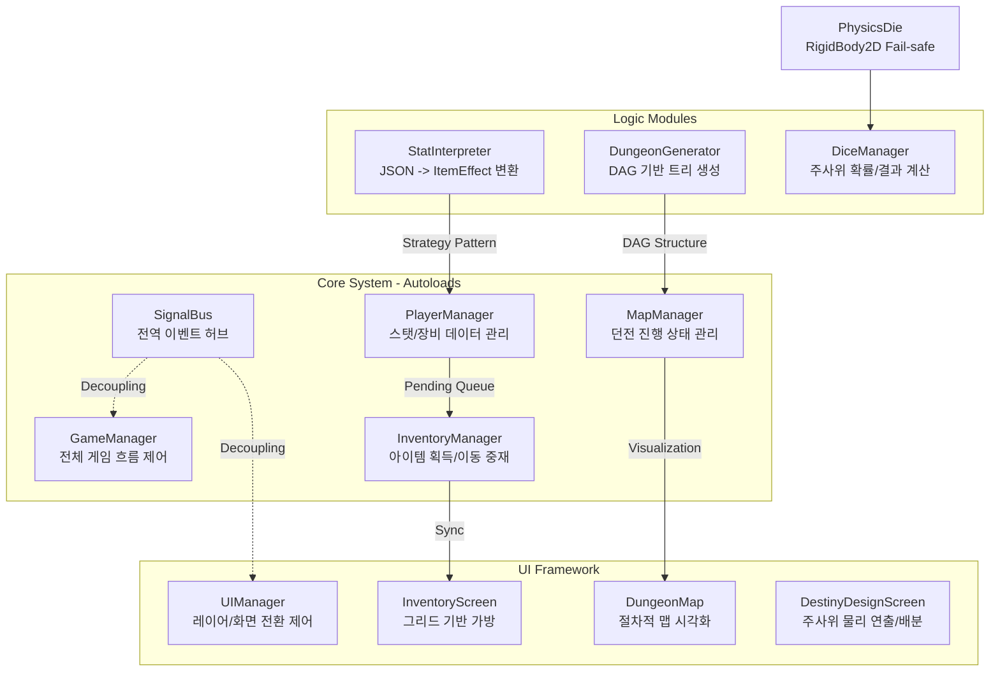

# 🎲 Dice Dungeon Crawling (DDC)
> **⚠️ 안내:** 본 저장소는 정식 출시를 목표로 개발 중인 프로젝트입니다. 보안 및 저작권 보호를 위해 **아트/사운드 리소스 및 기획 데이터 시트(JSON)를 제외한 시스템 아키텍처 및 핵심 로직 코드** 위주로 공개하고 있습니다.

**"물리 기반 주사위 시스템과 절차적 DAG 맵을 결합한 전략 로그라이크 RPG"**

본 프로젝트는 Godot Engine 4.4.1을 활용하여 제작 중인 1인 개발 로그라이크 게임입니다. 단순히 기능을 구현하는 것을 넘어, **데이터 중심 아키텍처 설계**와 **시스템 간의 느슨한 결합(Decoupling)**을 실천하는 데 중점을 두었습니다.

---

## 🏗️ 시스템 아키텍처 (Architecture)

---

## ✨ 핵심 기술 및 트러블슈팅

### 1️⃣ [물리] RigidBody2D 이탈 방지 및 Fail-safe 설계
- **문제:** 고속으로 주사위를 던질 때 물리 엔진의 한계(Tunneling 현상)로 주사위가 벽을 뚫고 화면 밖으로 사라지는 버그 발생.
- **해결:** `_setup_physics_walls()`를 통한 동적 벽 생성과 함께, 매 프레임 좌표를 감시하여 경계 이탈 시 중앙으로 **강제 텔레포트 및 급감속** 시키는 예외 처리 로직을 구축하여 시스템의 회복성(Resilience)을 확보했습니다.

### 2️⃣ [알고리즘] DAG 기반 맵 탐색의 논리 무결성 확보
- **문제:** 일방통행 구조임에도 레이어를 건너뛰거나 이전 노드로 역행하는 등 맵 탐색 규칙이 위배되는 논리 오류 발생.
- **해결:** `MapManager`를 통해 모든 노드의 방문 상태(`VisitedNodeIDs`)를 데이터화하고, 현재 노드와 인접한 `next_node_ids`만 필터링하여 활성화하는 **데이터 중심 상태 제어**로 무결성을 유지했습니다.

### 3️⃣ [아키텍처] UI-데이터 동기화를 위한 Pending Queue 시스템
- **문제:** 인벤토리 UI가 해제(queue_free)된 상태에서 아이템 획득 시 데이터가 유실되거나 참조 에러가 발생하는 강한 결합 문제.
- **해결:** `PlayerManager`에 **Pending Queue(대기열)**를 구축하여 UI 부재 시 획득한 데이터를 격리 저장하고, UI 재로드 시 비동기로 데이터를 복구하는 안정적인 동기화 프로세스를 설계했습니다.

---

## 🛠 Tech Stack
- **Engine:** Godot 4.4.1
- **Language:** GDScript
- **Key Concepts:** Strategy Pattern (Item Effects), SSOT (Single Source of Truth), DAG Algorithm, Physics Fail-safe

---
> "사용자 경험을 해치지 않는 완벽한 예외 처리와 견고한 설계를 지향합니다."
